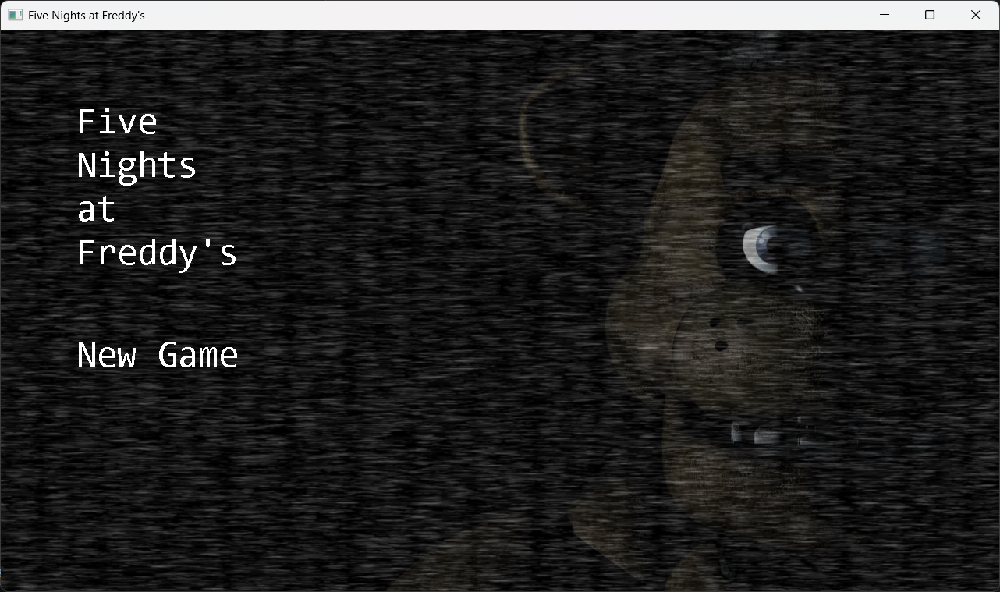

# FNAF Clone Made in SFML




This project is an early work-in-progress clone inspired by the "Five Nights at Freddy's" (FNaF) game, built using SFML (Simple and Fast Multimedia Library). 

Currently, the game features a **main menu** (which is not yet like the original game) and an **office** scene that doesn't function properly. Key elements, such as the **animatronics**, **camera system**, **doors**, and **buttons**, are not yet implemented or fully functional.

### Features (WIP)
- **Main Menu**: Basic framework in place, but not representative of the original game's main menu yet.
- **Office**: The office scene is available, though it's currently not functional.
- **Missing Features**:
  - Animatronics AI
  - Camera system
  - Door controls
  - Functional buttons
  - MOST IMPORTANTLY the honk :/

### Installation Instructions for Linux Users

To get started with the game on Linux, follow these steps:

1. **Install Dependencies**

   Open a terminal and run the following commands to install the required dependencies:

   ```bash
   sudo apt update
   sudo apt install build-essential glew-utils libglew-dev libsfml-dev libopenal-dev libsndfile1
   ```

   This will install the necessary packages:
   - `build-essential`: Basic development tools, such as `make` and compilers.
   - `glew-utils` and `libglew-dev`: Libraries for OpenGL extensions.
   - `libsfml-dev`: SFML development files for compiling the program.
   - `libopenal-dev` and `libsndfile1`: Audio libraries required for sound functionality in SFML.

2. **Verify OpenGL Installation (Optional)**

   If OpenGL is not already installed on your system, you can install the required tools using the following command:

   ```bash
   sudo apt install mesa-utils
   ```

   This package contains tools to check and verify your OpenGL installation.